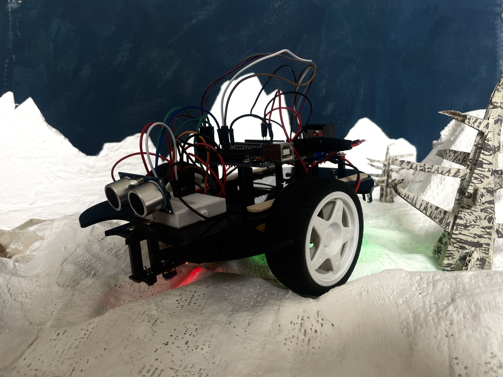
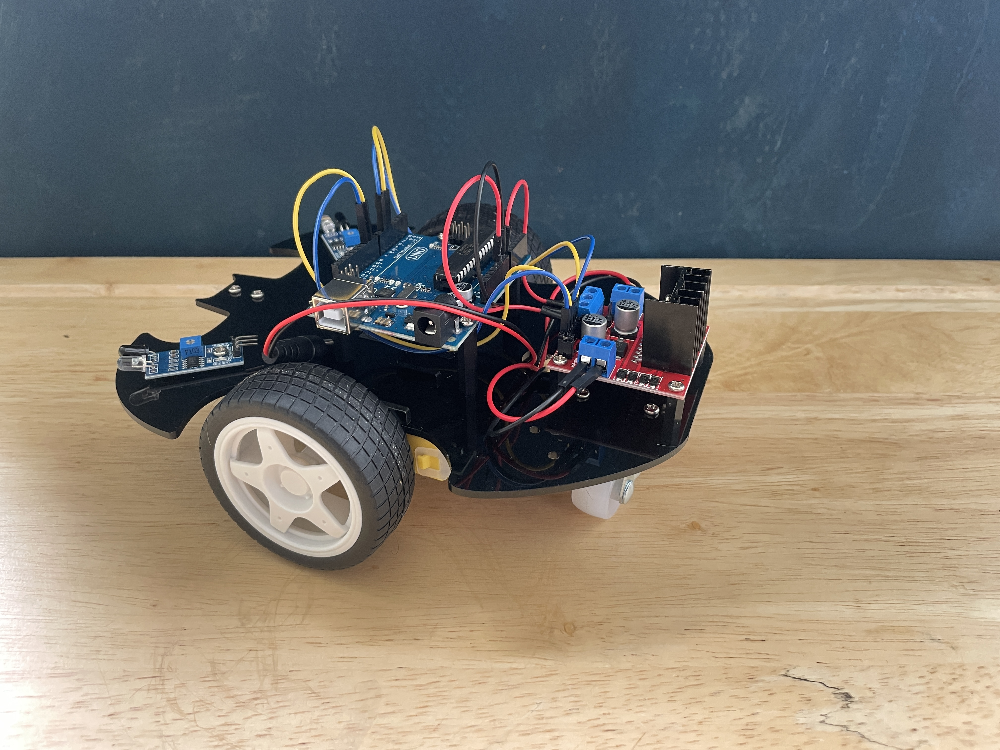
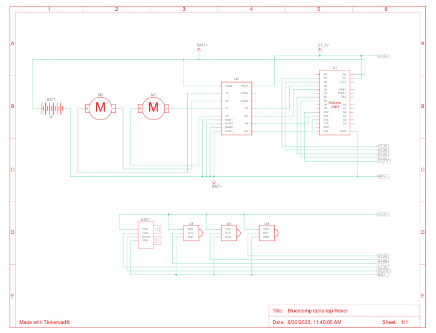

# Bluestamp wandering table-top Rover
During this project, I built a rover in which has the ability to wander on its own and avoid obsticales such as the edge of table tops. Using the Arduino Uno, which is a programable board that sends signals via digital pins. I coded the rover to acknowledge the obstacles and then perform a series of movements in order to avoid the obstacles. This project made me become extremely focussed on the technicallities of what makes a rover function. This includes both hardware, and code.

| **Engineer** | **School** | **Area of Interest** | **Grade** |
|:--:|:--:|:--:|:--:|
| Unai C. Z. | Fiorello H. Laguardia HS | Electrical Engineering | Incoming senior


  
# Final Milestone
For my Final Milestone, I worked on adding some more functionality out of my Rover. To do this, I added an UltraSonic sensor which has the ability to back away from walls. An Ultrasonic sensor essentially measures distance by sending a signal and then timing how long it takes to recieve back the signal. Based on this information, the Rover can tell how far away an obstacle is. 

# Code
```
void loop() {
float distance = readSensorData();
  if (distance > 10)  {
  moveForward();
  delay(random(0, 1000));
  }
else if (distance < 10 && distance > 2) {
  moveBackward();
  delay(random(0, 1000));
} else {
  moveForward();
}
}

float readSensorData()  {
  digitalWrite(trigPin, LOW);
  delayMicroseconds(2);
  digitalWrite(trigPin, HIGH);
  delayMicroseconds(10);
  digitalWrite(trigPin, LOW);
  float distance = pulseIn(echoPin, HIGH) / 58.00; //Equivalent to (340m/s*1us)/2
  return distance;
}
```

# Second Milestone
During my second Milestone, I had some drawbacks of motors not working and then revisting and revising my code in order to get the correct functionality out of my code. I eventually got the Rover to work correctly after switching the electrical pins on the arduino and rewriting to the code to match exactly what I had rewired on the Arduino. This lead me to be able to write code in order for my rover to recognize the edge of a table using a digital signal sent from the IR sensors, and then react by backing up and turning around. This was a huge step during the project, because recognizing the edge of a table is the first step when making a rover that can avoid certain obstacles. 

# Code 
```
const int in1 = 3;
const int in2 = 4;
const int in3 = 11;
const int in4 = 12;
const int ir = 2;
const int rightIR = 6;
const int leftIR = 7;

void setup(){
  pinMode(3, OUTPUT); // 3 and 4: right motor
  pinMode(4, OUTPUT);
  pinMode(11, OUTPUT); // 11 and 12: left motor
  pinMode(12, OUTPUT);
	pinMode(2, INPUT); // ir sensor
  pinMode(6, INPUT); // right IR
  pinMode(7, INPUT); // left IR
	pinMode(13, OUTPUT); // status led
  

Serial.begin(9600);
}

void loop(){
	int sensorValue = digitalRead(2);
  int RsensorValue = digitalRead(6);
  int LsensorValue = digitalRead(7);

Serial.println(RsensorValue);
if (sensorValue == 1){
//off the table
  digitalWrite (13, LOW);
}
if (sensorValue == 0) {
	//on the table 
	digitalWrite (13 , HIGH);
}
if (sensorValue == 1){
  moveBackward();
  delay(400);
  stopMove();
  delay(500); 
  stopMove();
  delay(500);
}

if (RsensorValue == 1)
{
  moveForward();
  delay(400);
  stopMove();
  delay(400);
}

if (LsensorValue == 1)
{
  moveForward();
  delay(400);
  stopMove();
  delay(400);
}
}
```

<iframe width="560" height="315" src="https://www.youtube.com/embed/IWtPTOME1gg" title="YouTube video player" frameborder="0" allow="accelerometer; autoplay; clipboard-write; encrypted-media; gyroscope; picture-in-picture; web-share" allowfullscreen></iframe>

# First Milestone
During my first Milestone, I started by putting together the parts so that they can be in places that had utility for later code and programs.
In order to test the hardware, I used a test program to run the motors in all directions to make sure that everything is hooked up correctly. however I began to have some issues when the motors didn't work in unisen. While troubleshooting,I learned how to hot wire my rover in order to isolate the problem. I started by manually putting the rover into the Forward and Backward modes by wiring the motors to have the sequence of:



# Code
```
void moveForward()  {
  digitalWrite(in1, LOW);
  digitalWrite(in2, HIGH);
  digitalWrite(in3, HIGH);
  digitalWrite(in4, LOW);
}
```

By hot wiring the rover to move forward, it isolates the problem because the Rover was able to move forward without the help of the Arduino.

<iframe width="560" height="315" src="https://www.youtube.com/embed/GgeViYFkuSQ" title="YouTube video player" frameborder="0" allow="accelerometer; autoplay; clipboard-write; encrypted-media; gyroscope; picture-in-picture; web-share" allowfullscreen></iframe>

# Schematics 



# Bill of Materials

| **Part** | **Note** | **Price** | **Link** |
|:--:|:--:|:--:|:--:|
|Sunfounder 3 in 1 learning kit | starter Arduino learning kit |$69.99 | <a href="https://www.sunfounder.com/products/sunfounder-3-in-1-iot-smart-car-learning-ultimate-starter-kit"> Link </a> |

# Other Resources/Examples

- [Sunfounder documentation](https://docs.sunfounder.com/projects/3in1-kit/en/latest/components/component_list.html)
- [Arduino Reference Code](https://www.arduino.cc/reference/en/)

